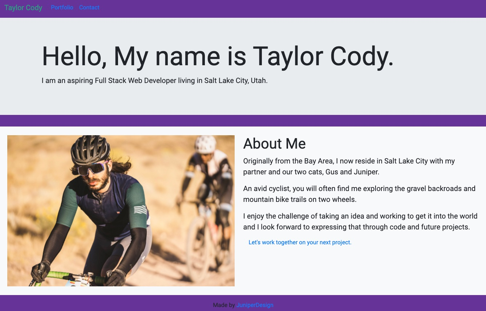
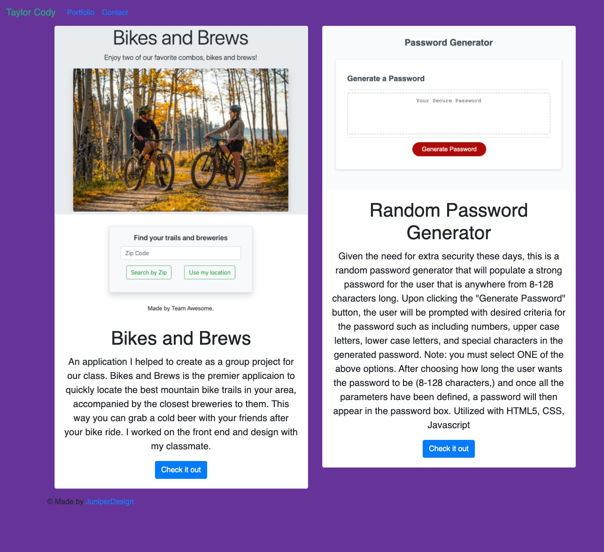

Responsive Portfolio for Taylor Cody 

Live site: https://taylorcodyx.github.io/cody_responsive_portfolio_hw_2/portfolio.html

Technologies Used:
    HTML5
    CSS
    Bootstrap

This is my work in progress portfolio showcasing a few projects I have worked on in the coding bootcamp in my journey to learn web development. As we progress in the program the portoflio website will be created with more advanced frameworks and methodology to showcase the skills we have learned. 

Contact information
    Email: taylormbcody@gmail.com
    Linkedin: https://www.linkedin.com/in/taylor-cody-532a7519b/

Copyright 2020 Taylor Cody

Permission is hereby granted, free of charge, to any person obtaining a copy of this software and associated documentation files (the "Software"), to deal in the Software without restriction, including without limitation the rights to use, copy, modify, merge, publish, distribute, sublicense, and/or sell copies of the Software, and to permit persons to whom the Software is furnished to do so, subject to the following conditions:

The above copyright notice and this permission notice shall be included in all copies or substantial portions of the Software.

THE SOFTWARE IS PROVIDED "AS IS", WITHOUT WARRANTY OF ANY KIND, EXPRESS OR IMPLIED, INCLUDING BUT NOT LIMITED TO THE WARRANTIES OF MERCHANTABILITY, FITNESS FOR A PARTICULAR PURPOSE AND NONINFRINGEMENT. IN NO EVENT SHALL THE AUTHORS OR COPYRIGHT HOLDERS BE LIABLE FOR ANY CLAIM, DAMAGES OR OTHER LIABILITY, WHETHER IN AN ACTION OF CONTRACT, TORT OR OTHERWISE, ARISING FROM, OUT OF OR IN CONNECTION WITH THE SOFTWARE OR THE USE OR OTHER DEALINGS IN THE SOFTWARE.